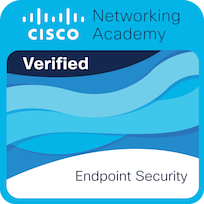
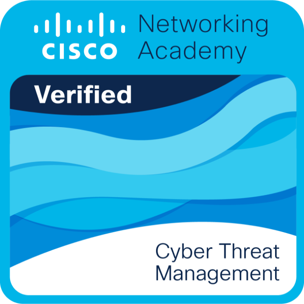
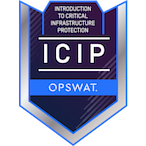
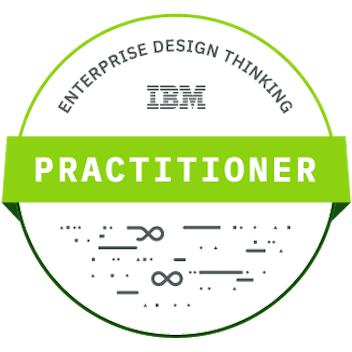

  
  <h1>Cybersecurity Professional | Anubhav Gain</h1>

 
  

### 👨🏻‍💻 &nbsp;About Me

I am Anubhav Gain, a cybersecurity professional based in Vadodara, Gujarat, India, with a passion for enhancing digital defenses and driving transformative growth in the cybersecurity domain. I hold a Bachelor of Technology degree in Cyber/Computer Forensics and Counterterrorism from Parul University and Licentiate degrees in Ransomware Techniques and Cybersecurity Management from Charles Sturt University. My strong educational background is complemented by practical experience in various domains of cybersecurity.

---

### 🛡️ &nbsp;Skills

- Rust Programming Language
- Information Security
- Threat & Vulnerability Management
- Cloud Security
- Network Security
- Fraud Detection
- Cyber Forensics
- Responsive Web Design

---

### 📈 &nbsp;Experience

**Owner, TechAnv Consulting**

_December 2022 - Present_

Vadodara, Gujarat, India

TechAnv specializes in providing top-notch IT consulting services to businesses seeking to optimize their technology infrastructure. We leverage extensive industry knowledge and expertise to help organizations drive growth, efficiency, and innovation through technology.

**Security Engineer, Lucid Growth**

_October 2023 - November 2023_

Bengaluru, Karnataka, India

Implemented stringent security protocols, conducted risk assessments, and responded to security incidents, enhancing digital infrastructure resilience against evolving threats.

**IT Specialist, Parul University**

_November 2022 - October 2023_

Vadodara, Gujarat, India

Deployed fortified AWS architectures, engineered Windows environments, and troubleshooted network issues to ensure robust security measures.

**Data Analyst - Fraud Detection, JPMorgan Chase & Co.**

_July 2023 - July 2023_

Analyzed financial datasets, utilized statistical methods and machine learning algorithms to detect fraudulent transactions, contributing to enhanced payment service security.

---

### 🏅 &nbsp;Certifications

**Security Program Regulatory Integration** - Demonstrates expertise in aligning security programs with industry regulations and standards, crucial for governance and compliance.

**Anomaly Detection: Network Anomaly Detection** - Validates proficiency in detecting anomalous network activity through statistical and machine learning techniques, critical for threat detection.

**Cybersecurity Virtual Experience Program** - Proves hands-on experience responding to real-world cybersecurity challenges within enterprise environments.

**Fundamentals of Information Security** - Verifies core knowledge spanning cryptography, access controls, operations security, disaster recovery, and business continuity practices.

**Responsive Web Design** - Confirms capabilities in developing secure, mobile-friendly web interfaces optimized across devices and browsers.

[View Credly Badges](https://www.credly.com/users/anubhavgain/badges) | [LinkedIn Certifications](https://www.linkedin.com/in/anubhavgain/details/certifications)

         

---

### 🥷🏻 &nbsp;Defender at CyberDefenders

---

### 🏆 &nbsp;Trophies

  

---

### 🛠 &nbsp;Tech Stack

#### Big Data & Data Processing

#### Cloud Services

#### DevOps & Deployment

&nbsp;

#### Networking & Security

#### Programming Languages

#### Tools

&nbsp;
&nbsp;

&nbsp;

---

### ⚙️ &nbsp;GitHub Analytics

---

### 🤝🏻 &nbsp;Connect with Me

